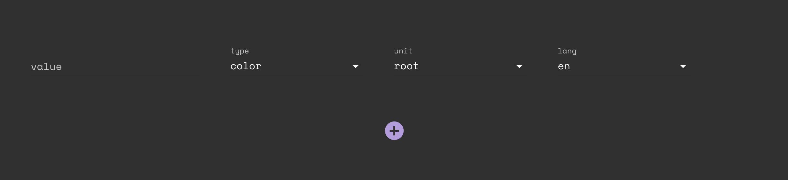
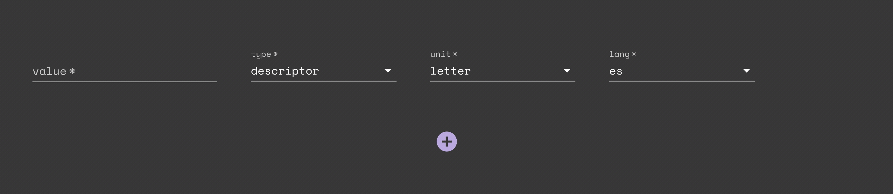

## the interface problem

I've been working on a small app to hand-annotate a dataset—[the XKCD color survey data](https://blog.xkcd.com/2010/05/03/color-survey-results/, "XKCD: color survey results"), in fact—for a data visualization project. I won't get into the what and why of the annotation now: that'll be the topic of a future blog post. It will suffice here just to describe the main annotation component and how it operates. The interface looks like this:

There are four inputs here: a freefrom text input setting a string `value`, a select setting a `type`, a select setting a `unit`, and a select setting a `lang`. As I move farther and farther along in the annotation of this dataset, it is more and more likely that a particular string `value` will already exist in my database complete with a `type`, `unit`, and `lang`. I want to ensure absolute consistency in my stored data; that is, I want to avoid ever storing a single unique string `value` twice with two different sets of `type`, `unit`, and `lang`. Relying on human memory for this kind of consistency is a poor idea, so instead I want to check for the existence of an item with the `value` of the current string `onBlur` of the input, then automatically correct the values of `type`, `unit`, and `lang` if what I have set (or not yet even touched from the defaults) does not match what is stored. In action, this looks like:

The auto-correct sequence here is 1) check for existence of an object with `value` of the current string `value` in the database and if 1) returns stored data then 2) set the `select`s to the correct values if they differ from what's stored.
